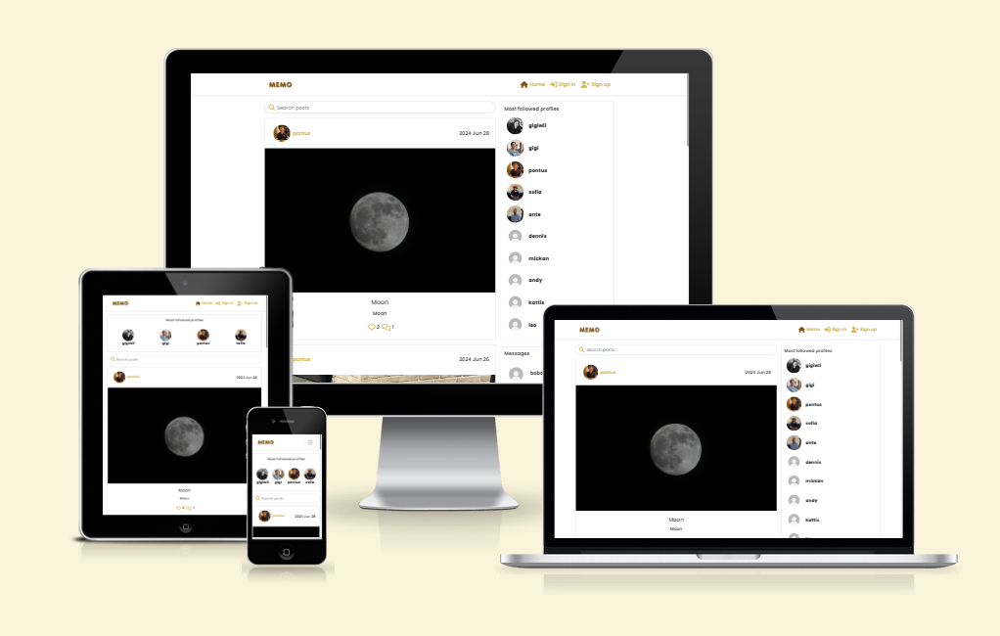
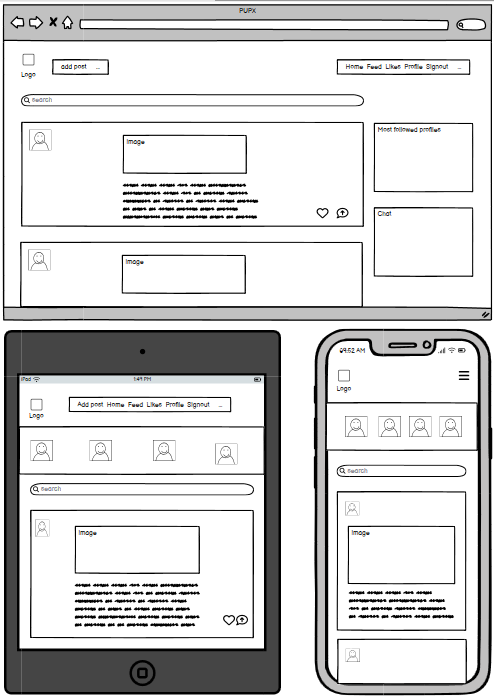
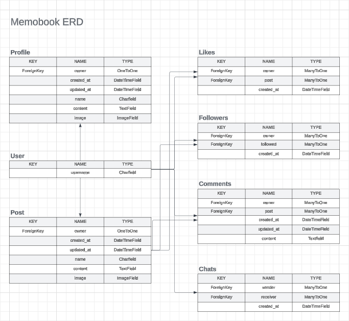
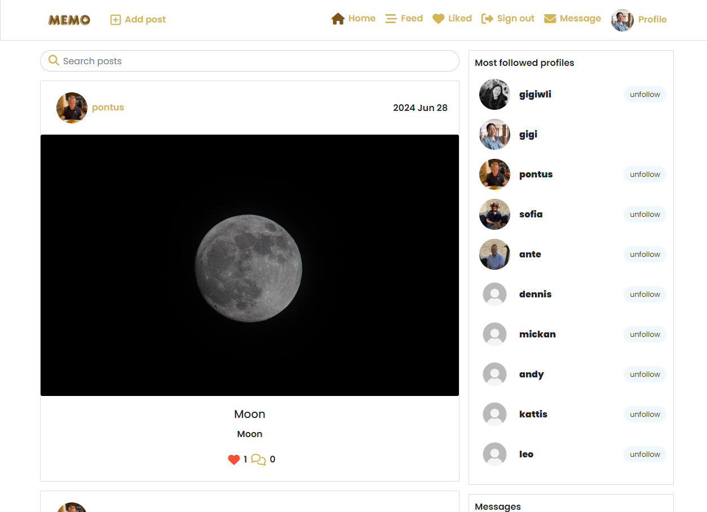
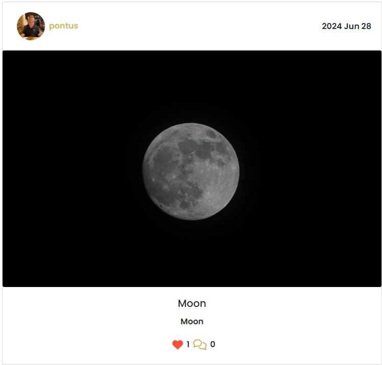
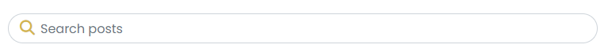
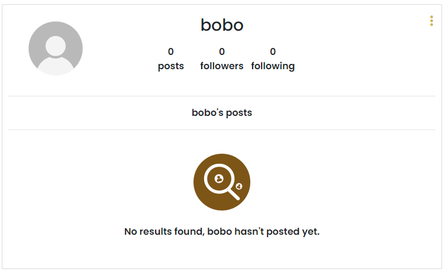
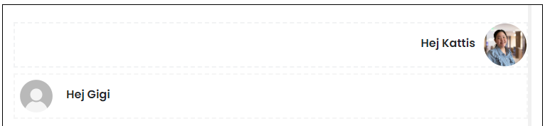
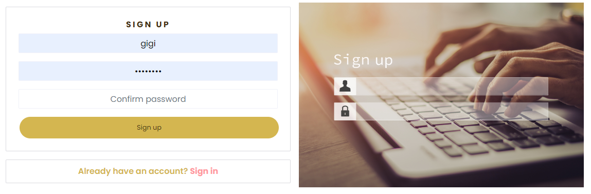
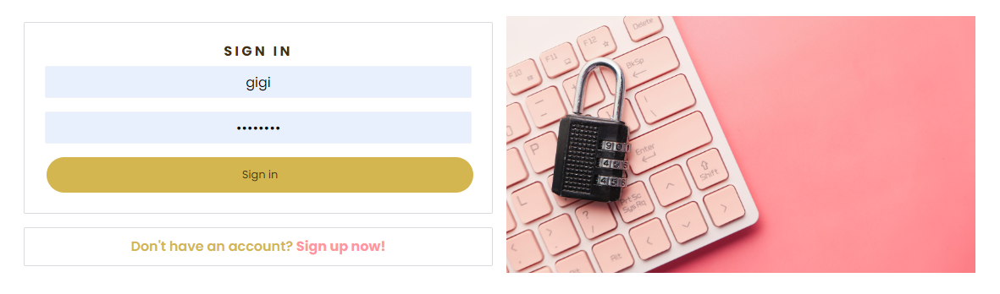

# About / Introduction

Link to the deployed project: (https://memobook-af0ef88c7472.herokuapp.com/signup)

Memobook, or Memo for short, is a platform for friends and family to connect and share posts with stories and images with eachother. Users are able to interact with posts/eachother by likes, comments and even chats. 

The idea for this project came to me as I was buildning a project along side the learning materials from Code Institute's walkthrough Moment, but with a twist and the idea of expanding the idea with something more. Memobooks concept was developed as a interactive place for people to connect and as the in the name, shar memos - Memories! After consulting with my mentor he also recommended to follow along with the walkthroughs and add at least one more function that is my own. 

The project is built in two parts, a backend and a frontend, keeping them seperate for a better overview. This part is the backend.

Link to the frontend repository on Github: (https://github.com/GigiLi89/memobook)
Link to the backend repository on Github: (https://github.com/GigiLi89/memobook-drfapi)

During the build of this project I mostly followed the walkthroughs provided by Code Institute. I've had a lot of issues and errors during the process but with the help of different tutors we've managed to fix it. Errors occured with the wrong versions, new errors either I or the tutors seen before etc. Therefor we've experiemnted and tried to solve the errors along the way. 

IMPORTANT: before running the frontend from the IDE, follow these steps in the terminal:
1) nvm install 16
2) nvm use 16
3) npm start

---

# Wireframes (created in Balsamiq)

Memobooks wireframes, a rough sketch of the project with the focus of the site being responsive as the priority as well as choosing colours that will meet accessability criterias. 

The difference between the desktop version compared to the tablet and mobile version is of course the layout but also the column to the right on the desktop page disapears on tablet and mobile mode. This will make it more user friendly and eliminate "not necessary" objects to optimize the space on a smaller display.

---

# ERD (created in Lucidchart)

---

# Process of building the workspace

After creating a new repository with the new CI template I opened the workspace in VS code through Gitpod. Most of the project was not made with Gitpod Enterprise since I had major issues moving there. After talking to both Student Care and 3 different tutors I was told to use the old Gitpod and wait for more information until the issues were fixed. 

I installed Django and started my DRF API project. I also started setting up Cloudinary, PostgreSQL and Heroku for:
- Cloudinary: To store images
- PostgreSQL: Database
- Heroku: For deployment

When starting the project I first created the DRF API and the necessary apps for the project: Profile, Post, Comment, Like, Followers and Chat. Models using the ERD's that were necessary to handle and store user data for the project in the database. Using generic views and serializers to create all of them.

---

# Features

## Header / Navigation Bar

In the header / navigation bar we have the logo in the upper left corner. The logo is also a link that will link back to the Home page. The logo will be there no matter if the user is logged in or not. 

If user is not logged in, user will have:
- HOME (will redirect to home page)
- SIGNIN (will redirect to sign in page)
- SINGUP (will redirect to sign up page)

If user is logged in, user will have:
- Add post (will redirect to add post page)
- HOME (will redirect to home page)
- FEED (will redirect to feeds page)
- LIKES (will redirect to likes page)
- PROFILE (will redirect to profile page)
- SINGOUT (will sign out user and resirect to home page)

## Home page

On the Home page the structure will look different depending on the device the user is on. Image at the top of the page on how it looks on different devices.

### Desktop
A searchbar is just under the header/navigation bar. The serachbar can be used to search for posts or posts made by a specific user. Under the search bar we have the post feeds. Next to the search bar and post feed we have a column with the profiles that are most popular/have most followers. 

### Tablet
In tablet mode it will almost look the same as the desktop mode apart from the popular profiles column which will instead be found at the top, above the search bar. 

### Mobile
In the mobile version it will almost look like the tablet version apart from the navigation bar at the top that is a hamburger menu instead of a vidible one. 

## Add Post page
On the Add Post Page we have the following features: Upload image, textarea to write a title and textarea to write some content. There is also a create and cancel button. Everything you need to create a post!

## Search bar

Searchbar at the top off the page to search for specific posts.

## Feed page
The feed page will show all the feeds from the profiles that you follow, with the newest post at the top.

## Liked page
The liked page will show the posts that the user has liked, like a collection of liked posts. 

## Profile page
On this page the users are able to view their own profiles as well as the their own posts. There is also a three dot menu for the user to change profile, like adding/changing profile image and adding bio. The user can also change username and password.

## Visiting other users profiles
By clicking on the avatar, the user will be redirected to that specific users profile where we will find information such as, how many followers, how many people the user is following and the users posts thats been made. 

---

## Chat
A chat function has been built where the user can either access the message page from under the "popular page"-page or from the navbar. 

---

## Register, Login or Logout
The user needs to sign up for an account and be logged in to be able to use the site fully. The user can for example not like or comment posts. 

### Sign up
Sign up for an account to get full access to all the features. To sign up, the user needs to fill out a username and password.

### Sign in
User can sign in by filling out the username and password field. 

### Sign out
User can sign out from the page simply by clicking the signout button at the top of the page. 

---

# Future Features
Some possible features in the future:
- Notifications, lets the user now that they have received a like, a comment or a follow. 
- Add multiple images to a post.
- Drafts, user can write drafts and post them at a later time. 

---

# User Stories

## First time visitors

- Wants to find out more about the platform
- Signs up for an account
- Checks posts

## Returning visitors

- Wants to be active on the platform with other users
- Wants to be updated with what other users are sharing
- Wants to keep contact with other users

---

# User Experience

Potential users
From children to adults can use the platform. Children should most likely have permission for an adult first. 
Anyone interested in staying in touch with others or just wants to keep updates about others. 

---

# Deployment

The site was pushed to Github Pages and deployed to Heroku. 
Link to the live page: (https://memobook-af0ef88c7472.herokuapp.com/)

1) Make sure everything is pushed to Github.
2) Login to Heroku and create a new app and follow the steps (the name you choose needs to be unique).
3) When app has been created got to settings, under Config Vars:
- key: SECRET_KEY   value: SECRET_KEY_VALUE

(Using any secret key generator or use the one created from Django)

- key: DATABASE_URL   value: DATABASE_URL_VALUE 

(DATABASE_URL is your PostgreSQL database url you get from CI Database.)

- key: CLOUDINARY_URL   value: CLOUDINARY_URL_VALUE

(Get this information from your personal Cloudinary account in the dashboard)

Do not share this information or publish it to your Github repository or the site may be compromised and vulnerable.

4) In the Deployment section, select Github as a method
5) Search for your repository (exactly as it's named) and click search
6) Click on the connect button to link up the repository
7) Scroll down to the bottom of the page to Manual deploy and click Deploy Branch
8) The app will start deploying and you can see the log as well
9) When the app is created you will see that is has been successfully built in the log and you can then click on Open App to see your final product. 

Make sure to deploy again if you make any changes to the files.

---

# Credits and Resources
- Canva, to create images and the logo
- Colour picker: https://www.w3schools.com/colors/colors_picker.asp
- MD convert: https://tabletomarkdown.com/convert-spreadsheet-to-markdown/
- Font Awesome: https://fontawesome.com/
- Google Fonts: https://fonts.google.com/
- Favicon: https://favicon.io/favicon-converter/
- Converter, from PNG to WEBP: https://convertio.co/
- React bootstrap: https://react-bootstrap.github.io/ + https://react-bootstrap.netlify.app/
- React Responsive Website tutorial: https://www.youtube.com/watch?v=-KjSWqdvPb8
- React tutorial: https://www.youtube.com/watch?v=SqcY0GlETPk
- The tutor team ad Code Institute and my coder friend. 
- Code Institute study material

### Code
- Code Institute Moment Tutorial Project, used through as a basis for the creation of this project
CREDIT: Code Institute Moment Tutuorial Project
URL: https://github.com/Code-Institute-Solutions/moments

---

# Testing
The testing was made and documented in a seperate file.
Please find the testing documentation [here](TESTING.md): 
